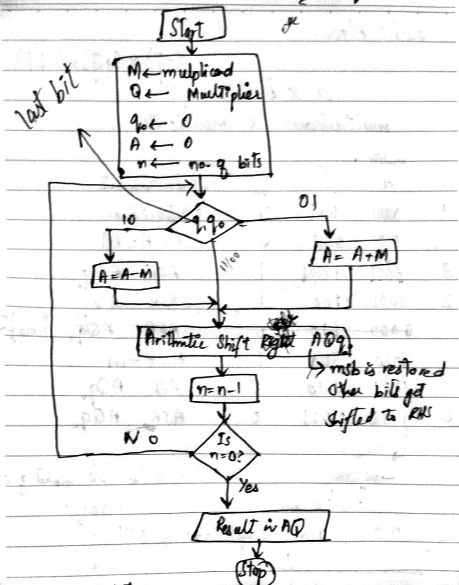

## Booth’s Multiplication Algorithm 

This program implements **Booth’s algorithm** for signed integer multiplication.

---

- **A** : Accumulator
- **Q** : Multiplier register  
- **M** : Multiplicand  
- **q0** : Single bit register basically for storing the *previous* LSB of Q  
- **q1** = current LSB of Q  
- **q0** = previous LSB of Q  

---

####  Logic

So,
At each iteration, checking for  the pair `[q1, q0]` 
Rules:
- `10` : Perform `A = A - M`  
- `01` : Perform `A = A + M`  
- `00` or `11` : Do nothing  

Then perform an **Arithmetic Right Shift (ASR)** on `(A, Q, q0)`.

---

#### Main Points
- **Arithmetic Right Shift** keeps the sign bit of `A`, ensuring negative numbers remain negative.  
- A **mask** ensures results fit within the specified bit-width (`n` bits).  
- After all iterations, `(A << n) | Q` forms the final result.  
- If the MSB (sign bit) of the result = `1`, the result is negative so, converting it using **2’s complement**.

---

#### Example Run
For `M = 91`, `Q = -8`, `n = 8` bits:

1. Initialize:  
A = 0, Q = -8, M = 91, q0 = 0 (as in code).
2. Repeating it for `n` cycles until n becomes n=0.
- Applying Booth’s rules  i-e (checking for q0,q1 and then updating A , doing ASR)
3. Final result after concatenation is : `-728`

---
For clarity, consider this example workflow from the paper:


---
#### Limitations:
It doesn't support dynamic calculation of **n** bits.

---
#### Sources Used:
- Youtube
---
#### Run:
```bash
gcc booths_multiplier.c -o booths_multiplier
./booths_multiplier 
```