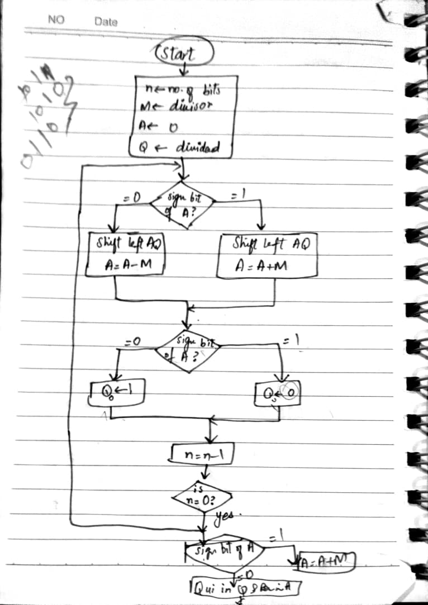

## Non-Restoring Division Algorithm

This program implements the **Non-Restoring Division Algorithm** .  
It calculates the **quotient** and **remainder** of an integer division using   shifting , adding and subtracting .

---

### Code Overview

| Register | Purpose |
|----------|---------|
| `t0`     | Q : Quotient (initially Dividend) |
| `t1`     | M : Divisor |
| `t2`     | A : Accumulator (Remainder) |
| `t3`     | Loop counter (number of bits) |
| `t4`     | Extracted MSB of Q |
| `t5`     | Address for `tohost` |
| `t6`     | Status flag for Spike termination |

---

####  Algorithm Steps

1. **Initialization**
   ```assembly
   li t0, 11      # Q = Dividend (1011)
   li t1, 3       # M = Divisor  (0011)
   li t2, 0       # A = 0 (Accumulator)
   li t3, 4       # Loop count (number of bits)

Other than this,some other steps are:

Loop (Repeat n times)
Shift left (A,Q)
Insert MSB(Q) into LSB of A
Update Q by left-shifting
Subtract divisor: A = A - M
If result negative : Restore: A = A + M
Set Q0 depending on sign of A
**Final Correction**
If A is negative, add divisor back:
A = A + M
**Masking**
then,keeping results within 4 bits:
andi t0, t0, 0xF   # Quotient
andi t2, t2, 0xF   # Remainder

---

### Example



### Built and Run the Program 
1. Assembled the .s file and linked it using the Makefile to create the executable. 
2. Ran the program using the Spike simulator .through the Makefile.